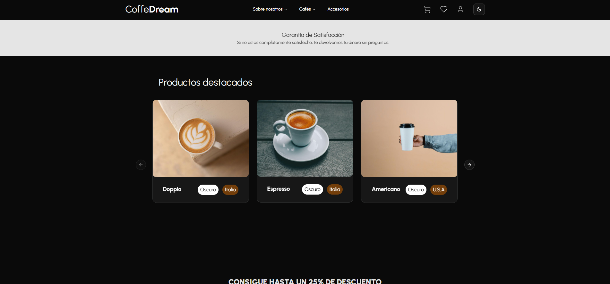
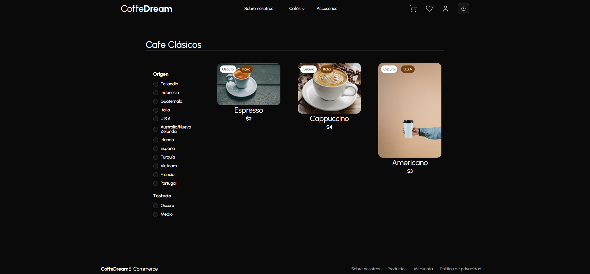
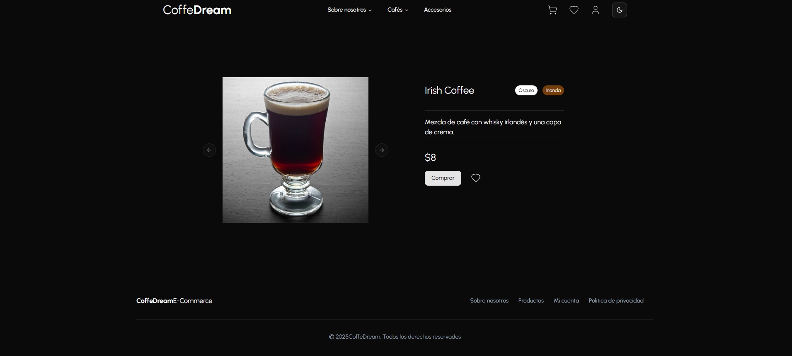

# CoffeeDream - Landing Page

## Descripción
CoffeeDream es una **landing page** de demostración que simula una tienda en línea dedicada a la venta de granos de café. Su propósito es servir como ejemplo de una aplicación **full stack**, donde el frontend se despliega en Vercel y el backend en Render, con almacenamiento de datos en Neon.tech. 

Dado que se utilizan servicios gratuitos, algunas imágenes pueden no cargarse correctamente en el frontend, y el backend podría pausarse temporalmente si no hay actividad.

## Tecnologías utilizadas
- **Frontend:** [Vercel](https://vercel.com/)
- **Backend:** [Render](https://render.com/)
- **Base de datos:** [Neon.tech](https://neon.tech/)

## URLs del proyecto
- **Frontend:** [CoffeeDream en Vercel](https://coffedream.vercel.app/)
- **Backend:** [CoffeeDream API en Render](https://backendcoffedream.onrender.com/)

## Capturas de pantalla

#### Home




### Categorías



### Productos



1. Clonar el repositorio:
```sh
git clone https://github.com/lllit/curso-ecommerce-coffe
```
2. Instalar dependencias:
```
cd frontend && npm install
cd ../backend && npm install
```

3. Configurar variables de entorno en el backend y frontend

4. Ejecutar el proyecto:
~~~
cd frontend-ecommerce && npm run dev
cd ../backend-ecommerce && npm start
~~~


Consideraciones
- El backend puede pausarse si no hay actividad debido a las políticas de Render.
- Las imágenes pueden no cargarse en el frontend debido a restricciones de los servicios gratuitos.

Contribuciones
Si deseas contribuir, por favor abre un issue o envía un pull request.


----------
